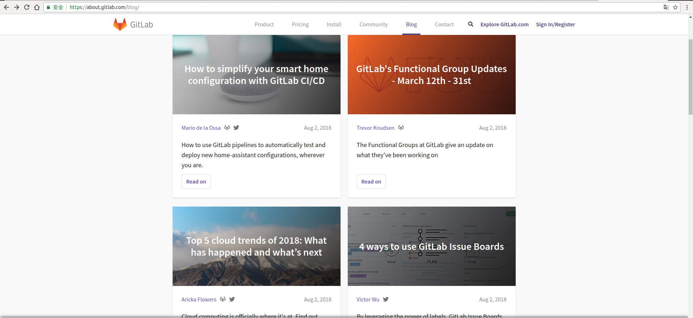
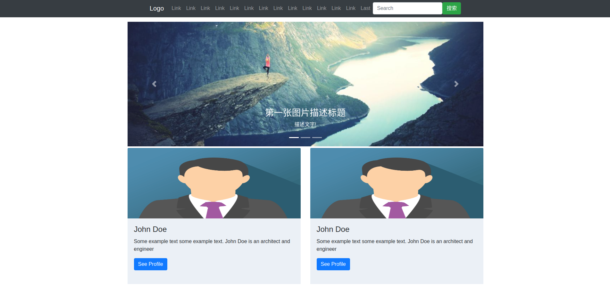

# 切尔诺阿尔法项目(一期)需求调研及分析
## 需求表述

### 需求背景&目标
*关键词:* ***技术实践*** ***现实需求满足*** ***平台老化*** ***知识的记录与总结*** ***优美的文字排版*** ***markdown*** 
该项目由Ruby程序员蒋某发起并担任开发团队核心及全部成员. 
技术从实践中来到生活中去.该项目致力于在掌握RubyOnRails框架的前提下满足蒋某本人实际生活中的一些实际需求. 
下面是蒋某关于需求的话述记录: 
我呢是一个工作一年左右的Ruby程序员,时间尚短,能力有限,我希望不断的提高自己的技术水平. 
在这个探索的过程中我发现*学习知识需要记录总结和分类*所以我想做一个博客网站. 
我不太喜欢在那些博客及论坛上面写东西,很大一方面的原因在于很多网站只会盛行一时,用户随着时间的流逝而流失. 
另一方面我发现很多人写的博客不会去去更新,写完放那就没事了,我个人觉得一篇好的文章是需要不断的推敲,git会保留每次提交新增及改动的内容这是我想要在博客平台实现的. 
markdown是我接触过的文字编写方面最强大也是如鱼得水的一个工具,所以平台一定要做到对markdown的最大程度支持. 
而且不仅要有内涵,而且文字排版,封面设计也要优美才行.

## 需求分析
针对客户嫌疑人蒋某的供述,我认为阿尔法一期的目标只做两个功能点: 

0. 博客列表页面
0. 博客详情展示页面

### 特性列表
0. 列表展示博客
0. 详情页面展示博客详情
### 主要逻辑
浏览列表页面,点击不同列表项跳转到相应的详情页面.
### 特性功能点
列表页面轮播图及列表图片的动态变换.
## 功能分析
#### 博客列表页面
列表页面蒋某表示可以参考GitLab的官网博客页面.

参考该页面设计了站点的博客列表页面:

轮播图用来展示精品博客,***现在和原野面比较,列表图片上缺少文字填充显得比较空荡,这是需要优化的地方***

## 开发时间安排
一期的主要阶段及阶段工作安排如下:

0. 开场 
原型图及静态页面调试完毕,除内容静态显示外一切开发完毕.
0. 中场休息 
内容动态展示所需数据库表结构等条件实施方案准备.
0. 下班场 
内容动态展现开发,开发问题汇总,二期需求及开发内容确定.

原则上不需要加时赛.
# 功能实现要求
0. 符合Rails开发主流风格
0. 在功能实现的前提条件下充分使用当下流行Gem
0. 编写代码过程中遇到的问题解决思路及措施要有详细的注释或日志.
0. 完备的学习心得,public下的doc目录用于存放设计文档和知识记录,要求井然有序,编写完善.

> [简书 | 如何写一份优秀的需求文档](https://www.jianshu.com/p/a06a33e569c8)
